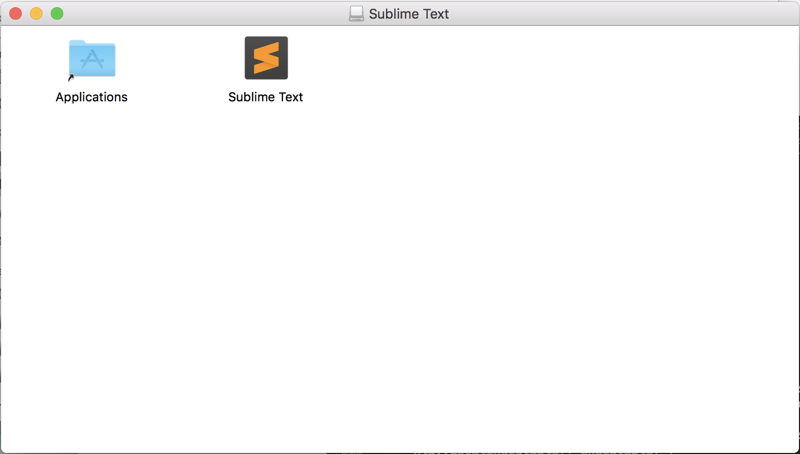
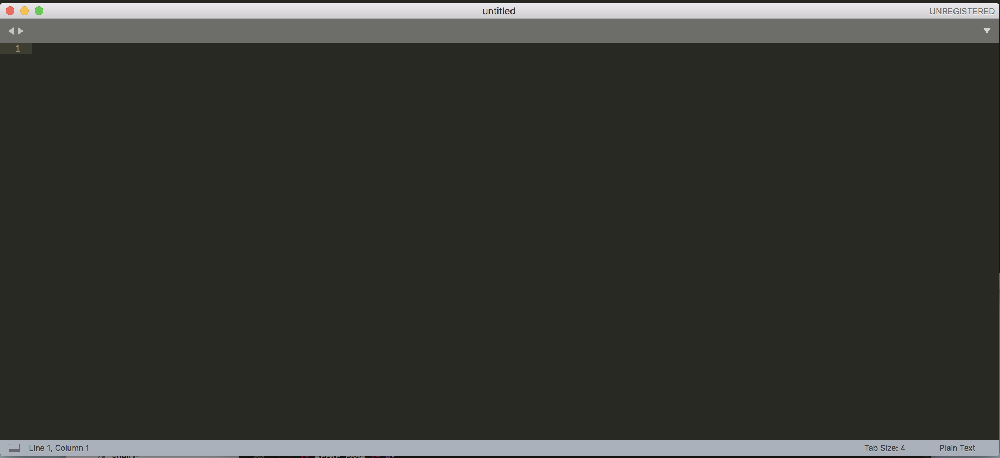
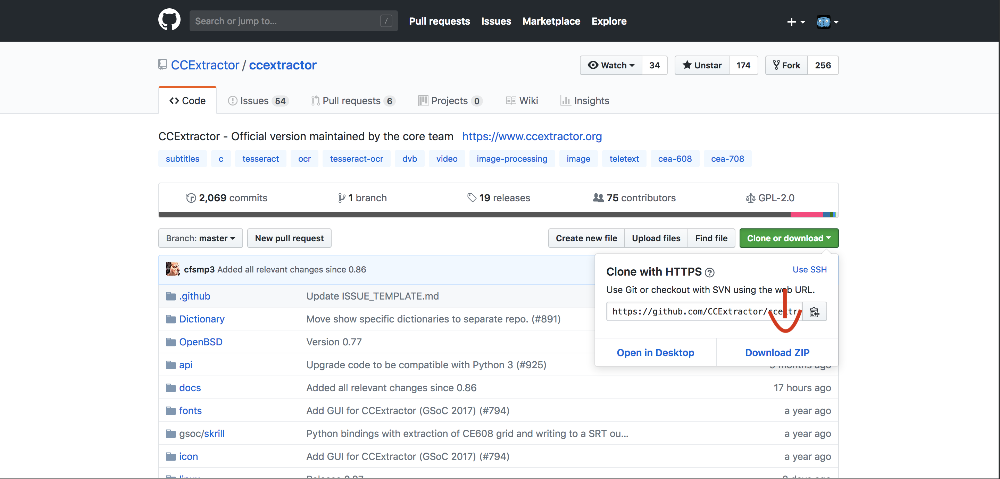
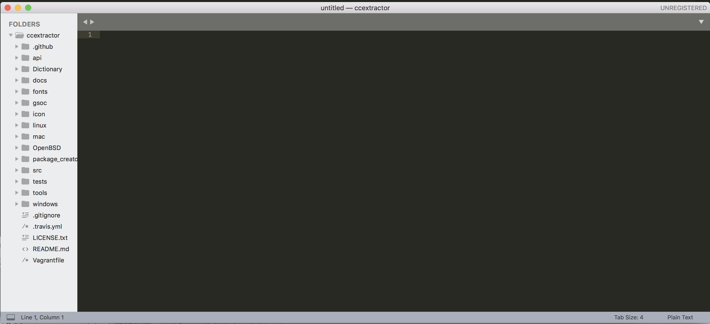
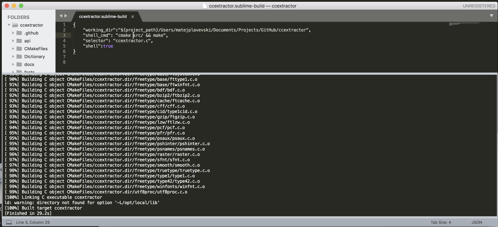

#  Using CCExtractor in Sublime


Sublime is a sophisticated text editor for code, markup and prose that is cross compatible and supports many 

languages. The great thing about Sublime is that it doesn't take a lot of space, memory. It's elegant and supports the additions of plugins and customization.

You can install it from: [Sublime Text - A sophisticated text editor for code, markup and prose](https://www.sublimetext.com/)

### Installation Method

For every platform is different but usually it's just following the instructions.

For Mac that is moving sublime to the Applications folder




Once it's done installing and when you open a new window it'll look something like this:



To use CCExtractor with sublime Clone the folder using git by using `git clone https://github.com/ccextractor/ccextractor` or downloading it from GitHub and unzip it



Once you have the repository move it into the sublime window and you'll have something that looks like this:




To edit a file feel free to select any and do modifications on it.

To build CCExtractor in sublime go to `Tools - Build System - New Build system`

And copy paste this into the new file:

```{
	"cmd": "cmake ../src/ && make",
	"selector": "ccextractor.c",
	"working_dir":"$file_path",
	"shell":true
}
```

If you have issues with the work path change the `working_dir` to the Path where CCExtractor is. Sometimes Sublime is dumb to figure out where it has to run stuff.



Then with the shortcut `CTRL - B` or `CMD - B` you can build CCExtractor from your sublime editor!
